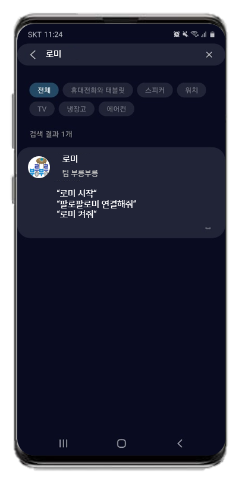
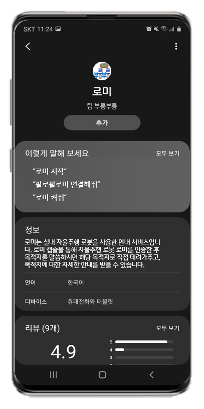
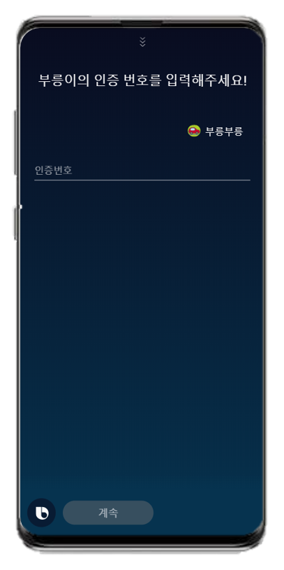
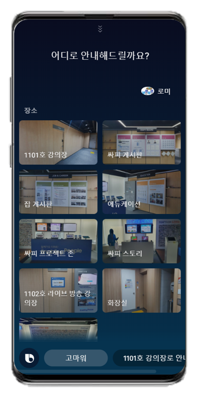
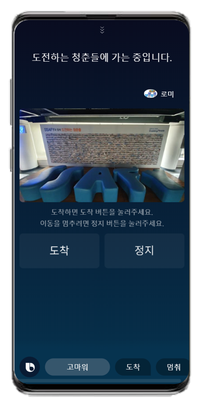
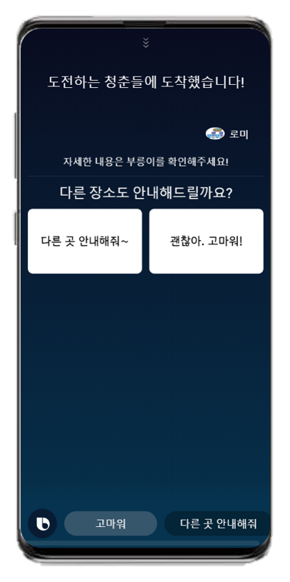

# BrrrBrrr Broombroom 💋

 


## Usage

```
1. 스마트폰의 빅스비를 실행합니다.
2. 부릉부릉 캡슐을 검색 후 추가합니다.
3. 빅스비에게 다음과 같이 음성으로 말합니다. **'부릉부릉 시작!'**
```

  


## Service

### 인증

 

### 안내

 **안내 선택**

- 안내 : 안내를 받을 수 있는 장소/행사로 안내 서비스를 이용할 수 있습니다.

- 투어 : 지정된 투어 코스를 따라서 장소/행사에 대한 설명을 들으며 투어합니다.

### 이동 및 도착

**도착 선택**

- 로봇이 이동중일 때의 화면입니다.
- 도착했을 시, 도착 버튼을 누르면 이동한 장소/행사에 대한 설명을 들을 수 있습니다.


## Flow


