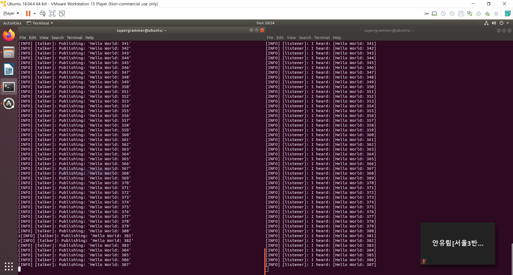

# **ROS**

---

## 1. ROS

### 1-1. ROS란??

 **ROS**는 **Robot Operating System**의 약자로, 2007년 5월, 모건 퀴글리(Morgan Quigley)에 의해 스탠포드 대학 AI 연구소가 진행하던 STAIR(Stanford AI Robot) 프로젝트인 스위치야드(Switchyard)라는 시스템에서 시작되었다. 2010년 1월 ROS 1.0이 출시되었으며, 2013년부터 Open Source Robotics Foundation이 개발 및 관리를 이어왔으며, 2017년 12월에는 ROS 2.0이 릴리즈 되었다.

 ROS는 매년 5월 23일을 World Turtle Day로 정하고, 15년부터 매년 새로운 버전을 알파벳 순서 코드네임 및 터틀 아이콘과 함께 출시하고 있다.

| **Distro**                                                   | **Release date**                                             | **Poster**                                                   |             ***Tuturtle\*, turtle in tutorial**              | **EOL date**             |
| ------------------------------------------------------------ | ------------------------------------------------------------ | :----------------------------------------------------------- | :----------------------------------------------------------: | ------------------------ |
| ROS Noetic Ninjemys                                          | May, 2020 (planned, see [Upcoming Releases](http://wiki.ros.org/Distributions#Upcoming_releases)) | TBA                                                          |                             TBA                              | May, 2025 (planned)      |
| [ROS Melodic Morenia](http://wiki.ros.org/melodic) (**Recommended**) | May 23rd, 2018                                               | [](http://wiki.ros.org/melodic) |  | May, 2023 (Bionic EOL)   |
| [ROS Lunar Loggerhead](http://wiki.ros.org/lunar)            | May 23rd, 2017                                               | [](http://wiki.ros.org/lunar) |  | May, 2019                |
| [ROS Kinetic Kame](http://wiki.ros.org/kinetic)              | May 23rd, 2016                                               | [](http://wiki.ros.org/kinetic) |  | April, 2021 (Xenial EOL) |
| [ROS Jade Turtle](http://wiki.ros.org/jade)                  | May 23rd, 2015                                               | [](http://wiki.ros.org/jade) |  | May, 2017                |
| [ROS Indigo Igloo](http://wiki.ros.org/indigo)               | July 22nd, 2014                                              | [](http://wiki.ros.org/indigo) |  | April, 2019 (Trusty EOL) |
| [ROS Hydro Medusa](http://wiki.ros.org/hydro)                | September 4th, 2013                                          | [](http://wiki.ros.org/hydro) |  | May, 2015                |
| [ROS Groovy Galapagos](http://wiki.ros.org/groovy)           | December 31, 2012                                            | [](http://wiki.ros.org/groovy) |  | July, 2014               |
| [ROS Fuerte Turtle](http://wiki.ros.org/fuerte)              | April 23, 2012                                               | [](http://wiki.ros.org/fuerte) |  | --                       |
| [ROS Electric Emys](http://wiki.ros.org/electric)            | August 30, 2011                                              | [](http://wiki.ros.org/electric) |  | --                       |
| [ROS Diamondback](http://wiki.ros.org/diamondback)           | March 2, 2011                                                | [](http://wiki.ros.org/diamondback) |  | --                       |
| [ROS C Turtle](http://wiki.ros.org/cturtle)                  | August 2, 2010                                               | [](http://wiki.ros.org/cturtle) |  | --                       |
| [ROS Box Turtle](http://wiki.ros.org/boxturtle)              | March 2, 2010                                                | [](http://wiki.ros.org/boxturtle) |  | --                       |

### 1-2. ROS의 기능

 ROS는 로봇 응용 프로그램을 개발할 때 필요한 하드웨어 추상화, 하위 디바이스 제어, 센싱, 인식, 슬램, 네비게이션 등의 기능 구현 및 다양한 개발 및 디버깅 도구를 제공하는 오픈 소스 기반의 로봇 메타 OS이다. 메타 OS란 일반적인 OS 위에서 동작하는 프레임워크를 말한다. 모든 소스는 BSD 라이센스(Berkeley Software Distribution License)로, 배포 시 해당 저작권자의 이름을 같이 배포하면 제약을 받지 않는다.

 ROS의 특징은 노드 간의 데이터통신 인터페이스를 정의 및 지원하고, 로봇의 하드웨어를 표현할 수 있는 문서 정의 및 센서 라이브러리 등을 제공하며, 슬램 및 네비게이션 라이브러리와 매니퓰레이션을 위한 GUI 툴 또한 제공되며, 시각화 도구와 3차원 시뮬레이터를 제공한다. 이러한 ROS는 다양한 플랫폼에서 다양한 버전이 공유되어 배포되고 있다.

### 1-3. ROS 1 vs ROS 2


## 2. ROS 설치

- ### 시스템 요구 사항

  Ubuntu Linux Bionic Beaver(v18.04), Ubuntu Xenial Xerus(v16.04) 에서 ROS 2가 지원된다. Ubuntu는 다음 링크에서 다운로드할 수 있다.

  http://releases.ubuntu.com/18.04.4/ubuntu-18.04.4-desktop-amd64.iso

   위 파일을 다운로드한 후, Virtual Machine 상에서 우분투를 실행할 수 있다. VMWare, VirtualBox 등의 툴을 사용할 수 있다. 물론 VM보다는 단독 혹은 멀티부팅으로 설치를 추천한다.


- ### Ubuntu 설치

   VMWare에서의 Ubuntu의 설치는 다음 링크를 따라 진행한다.

  https://recipes4dev.tistory.com/111
  


- ### ROS2 저장소 추가

   ```shell
   # Add ROS2 apt repositories
   sudo apt update && sudo apt install curl gnupg2 lsb-release
   curl -s https://raw.githubusercontent.com/ros/rosdistro/master/ros.asc | sudo apt-key add -
   
   # Add the repository in sources list
   sudo sh -c 'echo "deb http://packages.ros.org/ros2/ubuntu `lsb_release -cs` main" > /etc/apt/sources.list.d/ros2-latest.list'
   ```


- ### ROS2 다운로드

   https://github.com/ros2/ros2/releases

   [ros2-dashing-20200319-linux-bionic-amd64.tar.bz2](https://github.com/ros2/ros2/releases/download/release-dashing-20200319/ros2-dashing-20200319-linux-bionic-amd64.tar.bz2)

    위 링크에서 ROS2를 다운로드한다.

   ```shell
   mkdir -p ~/ROS2 && cd ~/ROS2
   
   # Unzip ROS2
   tar xf ./ros2-dashing-20200319-linux-bionic-amd64.tar.bz2
   ```


- ### rosdep 설치 및 실행

    rosdep는 ROS의 핵심 컴포넌트들을 사용하거나 컴파일할 때, 의존성 패키지를 쉽게 설치하여 사용자 편의성을 높여주는 기능이다.

   ```shell
   sudo apt update
   sudo apt install -y python-rosdep
   sudo rosdep init # if already initialized you may continue
   rosdep update
   ```


- ### 의존 패키지 설치

   ```shell
   CHOOSE_ROS_DISTRO=dashing
   rosdep install --from-paths ros2-linux/share --ignore-src --rosdistro $CHOOSE_ROS_DISTRO -y --skip-keys "console_bridge fastcdr fastrtps libopensplice67 libopensplice69 osrf_testing_tools_cpp poco_vendor rmw_connext_cpp rosidl_typesupport_connext_c rosidl_typesupport_connext_cpp rti-connext-dds-5.3.1 tinyxml_vendor tinyxml2_vendor urdfdom urdfdom_headers"
   ```


- ### python3 라이브러리 설치

   ```shell
   sudo apt install -y libpython3-dev
   ```


- ### DDS implementations 설치(optional)

   ROS의 DDS는 다음의 링크에 자세히 설명되어 있다.

  [DDS in ROS for Autonomous Driving](https://blog.naver.com/PostView.nhn?blogId=mesa_&logNo=221465721791&from=search&redirect=Log&widgetTypeCall=true&directAccess=false)

   설치는 다음과 같다.

  ```shell
  # from packages.ros.org/ros2/ubuntu
  sudo apt install libopensplice69
  sudo apt install -q -y rti-connext-dds-5.3.1
  ```

   설치 후, 다음 스크립트를 실행하면 `NDDSHOME`환경 변수를 설정해 준다.

  ```shell
  cd /opt/rti.com/rti_connext_dds-5.3.1/resource/scripts && source ./rtisetenv_x64Linux3gcc5.4.0.bash; cd -
  ```


## 3. ROS 환경 설정

- ### Setup script 실행

  ```shell
  . ~/ROS2/ros2-linux/setup.bash
  ```


- ### python argcomplete 설치(optional)

   자동 완성 기능을 이용하기 위해서는 argcomplete 패키지를 설치해야 한다. Ubuntu 18.04에서는 다음 명령어를 실행하면 된다.

  ```shell
  sudo apt install python3-argcomplete
  ```


- ### ROS 예제 실행

   첫 번째 terminal에서 다음과 같은 명령어를 실행한다.

  ```shell
  . ~/ROS2/ros2-linux/setup.bash
  ros2 run demo_nodes_cpp talker
  ```

   

   다음 두 번째 terminal에서 다음 명령어를 실행한다.

  ```shell
  . ~/ROS2/ros2-linux/setup.bash
  ros2 run demo_nodes_py listener
  ```

  

   결과가 다음과 같이 나온다면, 정상적으로 설치가 완료되었다는 뜻이다.

  


**[ 로봇 관련 커뮤니티 ]**

[오로카](http://www.oroca.org/)

[로봇공학을 위한 열린 모임 페이스북](https://www.facebook.com/groups/KoreanRobotics)

[로봇 소스](https://community.robotsource.org/)


**[ 출처 ]**

[ROS 하루에 입문하기 - 1](https://robertchoi.gitbook.io/ros/1)

[ROS2 설치 공식 문서](https://index.ros.org/doc/ros2/Installation/Crystal/Linux-Install-Binary/)