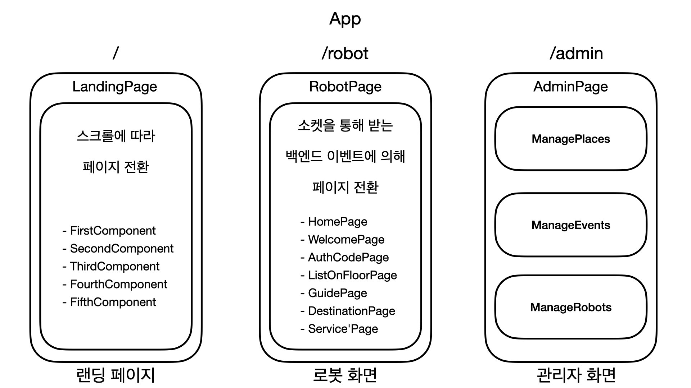

# BrrBrr - front page for user on robot


## Getting Started - 로봇 화면을 직접 실행해보고 싶다면..

### 1. `.env` 파일 작성

```
# <프로젝트 루트 폴더>/front-end/.env.dev

REACT_APP_SERVER_URL=http://localhost:3064/api/v1
REACT_APP_SOCKET_HOST=http://localhost:3064
```

### 2. 개발 서버 구동

- Node 패키지 설치

```bash
yarn
```

- 개발 서버 시작

```bash
yarn start
```

## 컴포넌트 구조



## 로봇 화면 와이어프레임

### HomePage

- 사용자가 보는 메인 화면


### AuthCodePage


### ListOnFloorPage


### GuidePage


### DestinationPage


## 사용가능한 명령어

- `yarn start`
  - 개발 서버를 실행합니다 기본 포트는 3000입니다
- `yarn test`
  - interactive watch mode 로 테스트 러너를 실행합니다
- `yarn build`
  - 실 서비스용 파일을 빌드합니다
- `yarn eject`
  - 빌드 툴을 커스터마이징합니다
